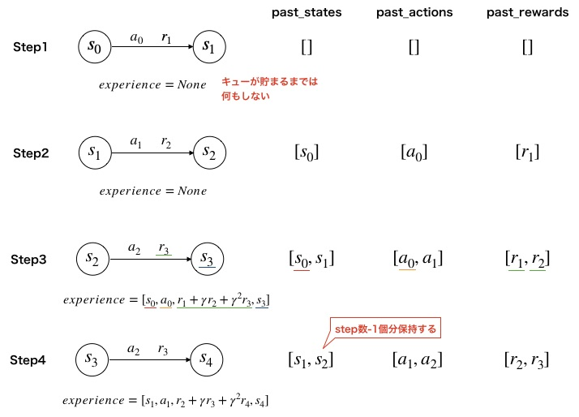

# スクリプト概要　　
* Multi Step Learningを使用したDQNの学習・実行機能を実装したスクリプト  

# 実行方法
## 学習
* 下記コマンドを実行  
`> python ../main.py -a DQN_with_multi_step -e <環境名>`　　
- 下記オプションを指定できる  
  -e : ゲーム環境の種類（'CartPole', 'Catcher', 'Mario'）  

* 学習が完了すると、学習したエージェントで1エピソード実行される  
* 実行するとlogフォルダ以下にタイムスタンプ名のフォルダが作成され、ログと学習結果が保存される  

## 実行  
* 下記コマンドを実行  
`> python ../main.py -a DQN_with_multi_step e <環境名> -p <学習済みモデルのパス> --play`　　
- 下記オプションを指定できる  
  -e : ゲーム環境の種類（'CartPole', 'Catcher', 'Mario'）  
  -p : 学習済みモデルのパス  

* 学習済みモデルのパスは「学習コマンド」実行時に生成されたログフォルダに保存される.ptファイルを指定する  
* 環境名は学習時に指定した環境と同じものを指定する

---
# Multi Step Learningの概要  
## Multi Step Learningとは  
* nステップ分の報酬と状態価値からTD誤差を計算する  
* Atariのゲームではn=3が良いとされている  

    例）n=3の場合  
  

---
# 実装メモ  
* キューを使用して実現している  
  