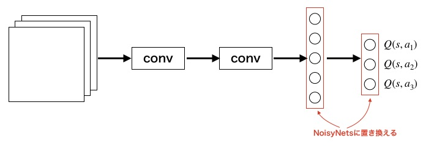

# スクリプト概要　　
* NoisyNetsを使用したDQNの学習・実行機能を実装したスクリプト  

# 実行方法
## 学習
* 下記コマンドを実行  
`> python ../main.py -a DQN_with_noisy_net -e <環境名>`　　
- 下記オプションを指定できる  
  -e : ゲーム環境の種類（'CartPole', 'Catcher', 'Mario'）  

* 学習が完了すると、学習したエージェントで1エピソード実行される  
* 実行するとlogフォルダ以下にタイムスタンプ名のフォルダが作成され、ログと学習結果が保存される  

## 実行  
* 下記コマンドを実行  
`> python ../main.py -a DQN_with_noisy_net e <環境名> -p <学習済みモデルのパス> --play`　　
- 下記オプションを指定できる  
  -e : ゲーム環境の種類（'CartPole', 'Catcher', 'Mario'）  
  -p : 学習済みモデルのパス  

* 学習済みモデルのパスは「学習コマンド」実行時に生成されたログフォルダに保存される.ptファイルを指定する  
* 環境名は学習時に指定した環境と同じものを指定する

---
# NoisyNetsの概要  
## NoisyNetsとは  
* ε-greedy法（探索手法）の改良を目的  
* ネットワークそのものに学習可能なパラメータと外乱を与え、それも含めて学習させていく  
    → より長期的かつ広範囲に探索可能  
* 全結合層をNoisyNetsに置き換える  
  <b><u>通常の全結合層の処理</u></b>  
  

  <b><u>通常の全結合層の処理</u></b>  
  

  σ：学習可能なパラメータ  
  ε：外乱（順伝播のたびに毎回ランダムに生成）  

  
