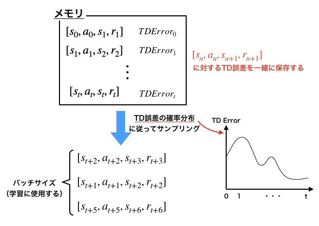

# スクリプト概要　　
* Prioritized Replayを使用したDQNの学習・実行機能を実装したスクリプト  

# 実行方法
## 学習
* 下記コマンドを実行  
`> python ../main.py -a DQN_with_prioritized_experience_replay -e <環境名>`　　
- 下記オプションを指定できる  
  -e : ゲーム環境の種類（'CartPole', 'Catcher', 'Mario'）  

* 学習が完了すると、学習したエージェントで1エピソード実行される  
* 実行するとlogフォルダ以下にタイムスタンプ名のフォルダが作成され、ログと学習結果が保存される  

## 実行  
* 下記コマンドを実行  
`> python ../main.py -a DQN_with_prioritized_experience_replay e <環境名> -p <学習済みモデルのパス> --play`　　
- 下記オプションを指定できる  
  -e : ゲーム環境の種類（'CartPole', 'Catcher', 'Mario'）  
  -p : 学習済みモデルのパス  

* 学習済みモデルのパスは「学習コマンド」実行時に生成されたログフォルダに保存される.ptファイルを指定する  
* 環境名は学習時に指定した環境と同じものを指定する

---
# Prioritized Replayの概要  
## Prioritized Replayとは  
* Experience Replayの改善手法  
* ランダムサンプリングではなく、TD誤差の大きいデータを優先的にサンプリングする  

## Prioritized Replayのイメージ  
エージェントの行動履歴と対応するTD誤差をメモリにプールする。  
各時刻のTD誤差を確率分布としてサンプリングする。  
  

ネットワークを更新するたびにTD誤差が変わるので、パラメータ更新する毎にプールされてる行動履歴の誤差を計算し直す。  

---
# 実装メモ  
* ある程度学習を進めてからPrioritized Replayを有効にする  
  学習初期段階はTD誤差が信頼できる値ではないので、TD誤差を基準にサンプリングしても非効率  
  → 指定回数（prioritized_experience_replay_valid_ep_num）学習するまではランダムサンプリングするようにする（でないと、学習が進まなかった）   
