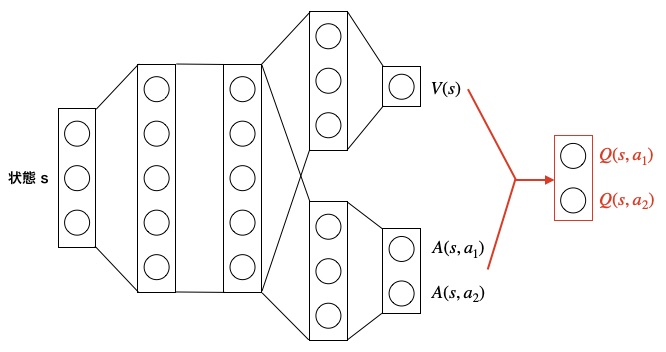

# スクリプト概要　　
* Dueling Networkの学習・実行機能を実装したスクリプト  

# 実行方法
## 学習
* 下記コマンドを実行  
`> python ../main.py -a DuelingNetwork -e <環境名>`　　
- 下記オプションを指定できる  
  -e : ゲーム環境の種類（'CartPole', 'Catcher', 'Mario'）  

* 学習が完了すると、学習したエージェントで1エピソード実行される  
* 実行するとlogフォルダ以下にタイムスタンプ名のフォルダが作成され、ログと学習結果が保存される  

## 実行  
* 下記コマンドを実行  
`> python ../main.py -a DuelingNetwork e <環境名> -p <学習済みモデルのパス> --play`　　
- 下記オプションを指定できる  
  -e : ゲーム環境の種類（'CartPole', 'Catcher', 'Mario'）  
  -p : 学習済みモデルのパス  

* 学習済みモデルのパスは「学習コマンド」実行時に生成されたログフォルダに保存される.ptファイルを指定する  
* 環境名は学習時に指定した環境と同じものを指定する

---
# Dueling Networkの概要  
## Dueling Networkとは  
* Q値の出力方法を工夫したネットワークを使用するDQN派生のアルゴリズム  
  <b><u>DQN</u></b>  
  直接Q値を推定する  
  <b><u>Dueling Network</u></b>  
  状態価値V(s)、アドバンテージA(s,a)を推定する  

## アドバンテージについて  
* 行動価値は状態のみによって決まる部分と行動によって決まる部分に分解できる  
  状態のみによって決まる部分が状態価値、行動によって決まる部分を**アドバンテージ**という  

  例）CartPole  
  倒れる直前は右に動こうが左に動こうが報酬は低くなる  
  → V(s)が大きく、A(s,a)が小さい状態ということ  

## ネットワークのイメージ  
  

単純に出力を加算するだけだと、それぞれの出力がV(s)、A(s,a)を表現していると言えないので、工夫（制御)を加える必要がある  
(足して Q値になる組み合わせは無限にあるので、一意に定まるように制限を加える)  

ある方策πについて、状態価値V(s)と行動価値Q(s,a)は以下のように定義される  
  
（行動価値は状態s、行動a、方策πの時の報酬和R_tの期待値）  
 

  
（状態価値は全てのaに対するQ(s,a)の期待値）  
 

のような決定的な方策の場合、

なので、

が成り立つ。  

上記のアドバンテージの条件を制約に加えると、行動価値は下記の式で計算できる  

定義とは少し異なるが、より安定する下記式を使う  
  

