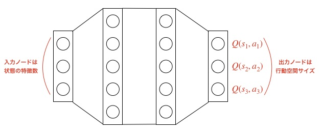
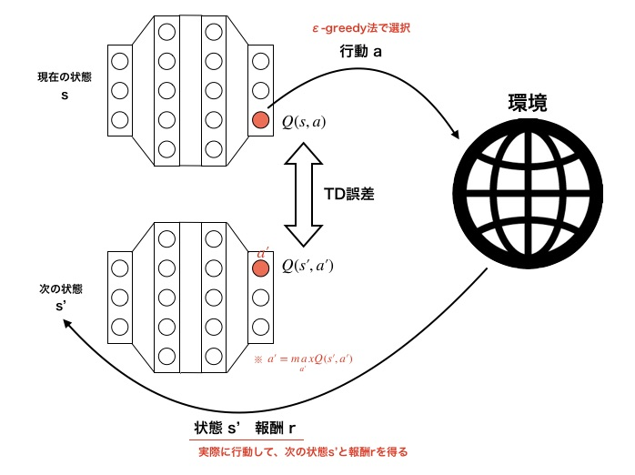

# スクリプト概要　　
* DQN派生の強化学習アルゴリズムを実装したスクリプト  
* 実装済みのアルゴリズムは下記の通り  
  各アルゴリズムの詳細はそれぞれのフォルダを参照  
    * DQN  
    * DDQN  
    * DQN_with_prioritized_experience_replay  
    * DuelingNetwork  
    * DQN_with_multi_step  
    * DQN_with_noisy_net  
* ここでは、DQNの実行方法、概要について記載  

# 実行方法
## 学習
* 下記コマンドを実行  
`> python main.py -a DQN -e <環境名>`　　
- 下記オプションを指定できる  
  -e : ゲーム環境の種類（'CartPole', 'Catcher'）  

* 学習が完了すると、学習したエージェントで1エピソード実行される  
* 実行するとlogフォルダ以下にタイムスタンプ名のフォルダが作成され、ログと学習結果が保存される  

## 実行  
* 下記コマンドを実行  
`> python main.py -a DQN e <環境名> -p <学習済みモデルのパス> --play`　　
- 下記オプションを指定できる  
  -e : ゲーム環境の種類（'CartPole', 'Catcher'）  
  -p : 学習済みモデルのパス  

* 学習済みモデルのパスは「学習コマンド」実行時に生成されたログフォルダに保存される.ptファイルを指定する  
* 環境名は学習時に指定した環境と同じものを指定する

# 学習結果例  
環境：Mario  
アルゴリズム：DDQN  
学習エピソード：40000回（GPU環境で約34.5h学習）  

---
# DQNの概要  
## DQNとは  
* 行動価値Q(s,a)をニューラルネットワークで表現したQ学習  

<u>通常のQ学習</u>  
* 表形式でQ関数を表現  
* 状態空間が大きくなったとき（状態空間が連続値など）、メモリが足りなくなる  

　  

<u>DQN</u>  
* 状態を入力、各行動に対応する行動価値を出力するネットワークでQ関数を表現  

## DQNの損失関数  
* TD誤差を損失関数として設定する  
  

## DQNの工夫  
* 学習を安定させるため、DQNでは4つの工夫をしている  

1. Experience Replay  
    * エージェントの行動履歴をメモリにプールしてからランダムサンプリングして学習する  
    * 各ステップごとに学習すると、時間的に相関が高いデータを連続して学習することになるので、パラメータの更新が安定しない  

2. Fixed Target Q-Ntetwork  
    * 現在の価値を計算するネットワークと遷移先の価値を計算するネットワークを別々にする（学習するたびに教師データ（更新後の価値）が変わると学習が安定しない）  
    * 現在の価値を計算するネットワークを**メインネットワーク**、遷移先の価値を計算するネットワークを**ターゲットネットワーク**という  
    * 学習時はメインネットワークのみ更新し、一定時刻ごとにメインネットワークをコピーしてターゲットネットワークに上書きする  

3. 報酬のクリッピング  
    * 各ステップにおける報酬を-1、0、1のどれかに設定する  
      → 対象によらず同じハイパーパラメータで学習できるようになる  

4. Huber関数の使用  
    * 損失関数にHuber関数を採用する  
      → 誤差が大きいときに二条誤差を使うと、出力が大きくなりすぎて学習が安定しなくなる  

---
# 実装メモ  
* 行動選択時に最初からεの値が小さいε-greedy法だと学習が安定しない  
  未学習の状態でQ値から行動選択すると不正に偏る  
  → 学習を行うまではランダム探索した方が良い（というより、そうしないと学習が進まない）  

* 状態が画像データの場合、そのままだと情報過多で学習が進みにくいため下記の前処理を行う  
  1. グレースケール化  
  2. リサイズ  
  3. 正規化  
  4. SkipFrame  
     → 1度のstepで複数フレーム進める（行動は同じものを使用、報酬は蓄積された値とする）  
  5. FrameStack  
     → 連続した複数フレームをまとめて入力とする（どのような動きをしているのかエージェントが識別できる）
