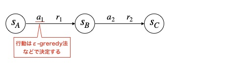
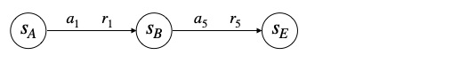

# スクリプト概要
* モンテカルロ法でFrozenLakeを強化学習するスクリプト  

# 実行方法
## 学習
* 下記コマンドを実行  
`> python main.py`　　

* 学習が完了すると、学習したエージェントで1エピソード実行される  
* 実行するとlogフォルダ以下にタイムスタンプ名のフォルダが作成され、ログと学習結果が保存される

---
# モンテカルロ法の概要
## モンテカルロ法とは
* モデルフリーの価値ベース手法。  
* エージェントを動かし、実際に得られた報酬から状態価値を推定する。  
  エピソードを何度も繰り返すことで精度を上げる。  
  (要は繰り返し実行して期待値を求める方法)  

## モンテカルロ法の処理イメージ  
例）状態s_Aの状態価値をモンテカルロ法で推定する  
<b><u>1回目の試行</u></b>

現在の推定状態価値  

実際に得られた状態価値  

更新した状態価値  
（今までの推定値と実際に得られた価値の平均）  

<b><u>2回目の試行</u></b>

現在の推定状態価値  

実際に得られた状態価値  

更新した状態価値  

...　　

<b><u>N回目の試行</u></b>  
十分な回数を繰り返すことで確率が収束する  

現在の推定状態価値  

実際に得られた状態価値  

更新した状態価値  

---
# 実装メモ  
* 観測した事がない状態の時に価値関数に従って行動選択すると選択が偏って学習できなくなるので、ランダムに行動選択させるようにする。  
（全ての行動価値の初期値は0にしているため、学習前の状態で値が大きい行動を取得しようとすると、リストの最初の行動しか選択されず学習ができなくなる）
* αは状態sの時に行動aが選ばれた回数（trainer.pyのN）を使用する。  