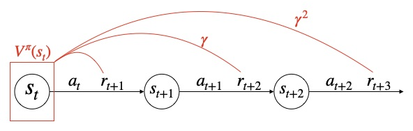
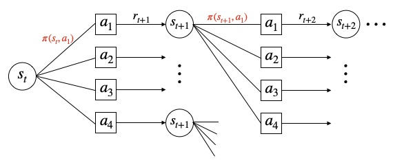

pytorchによる強化学習スクリプトと概要をまとめたリポジトリ

実装済みのアルゴリズムは下記の通り   

* モンテカルロ法  
* TD法  
    * Sarsa  
    * Q-Learning    
* 深層強化学習（DQN派生）  
    * DQN  
    * DDQN  
    * DQN_with_prioritized_experience_replay  
    * DuelingNetwork  
    * DQN_with_multi_step  
    * DQN_with_noisy_net  

環境構築は下記のコマンドを実行  
`> pip install -r requirements.txt`

---
# 強化学習の概要
## 強化学習とは
強化学習は環境の中で試行錯誤を繰り返し、価値の高い行動を学習する機械学習の一種。  
AIは現在の状態を参考に何らかの行動をして、その結果として報酬が与えられる。そして「実行した行動」と「報酬」を結びつけて「行動の価値」を評価・改善し、最適な行動を学習していく。  

強化学習では、行動を選択して学習する主体（AI）を**エージェント**、状態や報酬を与えるもののことを**環境**と呼ぶ。  

## 強化学習の定式化
強化学習の環境はマルコフ決定過程（MDP）と仮定され、下記の要素で構成される。  

 * 状態s  
 * 行動a  
 * 遷移関数T：状態sと行動aを受け取り、遷移可能な状態s'とs'へ遷移する確率を返す関数  
 * 報酬関数R：状態sと次状態s'を受け取り、報酬rを返す関数  

将棋で例えると、状態は「盤面」、行動は「その盤面で打てる手」、遷移確率は「ある盤面で、ある手を打った時に相手が打つ手の確率モデル」、報酬関数は「勝った時にプラスの報酬、負けた時にマイナスの報酬を返す関数」のようなイメージ。  

学習の流れは下記の通り  

1. エージェントが現在の状態s_tを観測  
2. 方策πに従って行動a_tを決定  
3. 環境の状態が遷移関数Tに従ってs_tからs_t+1へ遷移  
4. 即時報酬r_tと次の状態s_t+1がエージェントに渡される  

方策πは状態sが与えられた時に行動を返す確率分布。
また、一連の行動が完了した時に得られる報酬の総和Gは下記のように表される。  

強化学習の目的（価値の高い行動を学習する）は、「**Gを最大化できるような方策πを学習する**」と言い換えることができる。

重要なのは、一つ一つの行動に対する価値（即時報酬）ではなく、一連の行動に対する価値（報酬和）の最大化が目的であること。  
つまり、エージェントは即時報酬が高くない行動も場合によっては選択しなければならないことを学習する必要がある。

## 状態価値関数
**状態価値関数**  ：状態s_tの価値を返す関数  
「状態s_tの価値」とは、状態s_tを起点に方策πに従って行動を撮り続けて行った時に得られる報酬の合計。  
ただし、未来の報酬は不確かなので係数γ（割引率）をかける。  

状態価値関数は再帰的に下記のように表現することができる。  

基本的な考えは上記の通りだが、実はまだ不十分。いくつかの条件分岐を考慮する必要がある。  

### 方策による条件分岐  
状態s_tのときに選択される行動a_tは方策πによって確率的に決まる。  

### 遷移確率による条件分岐
状態s_tのときに行動a_tを選択したときの次の状態s_t+1は遷移確率Tによって確率的に決まる。

最終的に状態価値関数は下記の式で表される。

  

* 確率的な分岐は期待値で計算する  
* 式にπが含まれることから分かる通り、状態価値は方策πに依存する  
* この式のことを**ベルマン方程式**と呼ぶ  

## モデルベースとモデルフリー
強化学習の問題設定は大きく2つに分けられる。  
* モデルベース：環境の情報（遷移確率T、報酬関数R）を全て知っているという問題設定  
* モデルフリー：遷移関数と報酬関数が分からない前提の問題設定  

モデルベースの場合、ベルマン方程式を数値的に計算することができるので、モデルフリーよりも効率的に学習をすることができる。しかし現実的には環境を上手くモデル化できることは少ないため、モデルフリーの手法の方がよく用いられる。  
モデルフリーは数値的にベルマン方程式を解くことができないため、シミュレーションを繰り返して価値関数を推定していく。  

## 価値ベースと方策ベース
強化学習の行動の選び方は大きく2つの方針がある。  

1. 価値ベース  
状態価値を計算し、値が最も高い状態に遷移するように行動する。（要は必ず価値が高い方へ行動する）  
学習では価値関数のみが更新される。  
状態sのとき、価値ベースでの行動aは下記式で表される。  

2. 方策ベース  
何かしらの確率モデルで定義された方策πに従って行動する。  
学習では現在の方策πにおける価値を計算し、それを元に方策πのパラメータが更新される。

## 探索と利用  
高い報酬を得られる行動を探すためにランダムに行動選択することを**探索**、学習した結果から良さげな行動を選択することを**利用**という。  
利用のみを繰り返すと限られた行動しか選択できず最適な行動を取ることができない。  
そのため、強化学習では適度に探索をしながら利用をする必要がある。  
よく用いられる手法は下記の通り。  

* ε-greedy法  
εの確率で探索を行い、それ以外の場合は利用（greedyな行動）を行う手法。  
例えば、ε=0.2であれば、20%の確率で探索を行い、80%の確率で利用を行う。  
