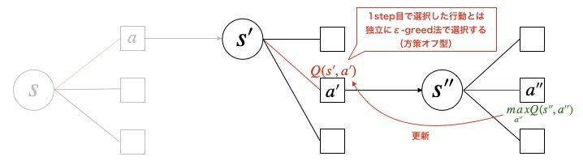

# スクリプト概要
* Q-learningでFrozenLakeを強化学習するスクリプト  

# 実行方法
## 学習
* 下記コマンドを実行  
`> python main.py`　　

* 学習が完了すると、学習したエージェントで1エピソード実行される  
* 実行するとlogフォルダ以下にタイムスタンプ名のフォルダが作成され、ログと学習結果が保存される  

---
# Q-learningの概要  
## 前提
* Q-learning（やSarsa、DQN）は状態価値ではなく、**行動価値Q(s,a)** を用いる。  
  行動価値Q(s,a)とは、状態sのときに行動aを取ったときに未来に得られる報酬の期待値。  

## Q-learningとは  
* TD法のアルゴリズムの一種  
* 1ステップごとにTD誤差を計算して行動価値を更新していく  
* 更新の際の行動選択と実際の行動選択はそれぞれ独立に決定する**方策オフ型**の手法  

更新式は下記の通り。  

## Q-learningの処理イメージ  
<u>1step目</u>  
次の行動a'は最も（見積もりの）行動価値が高い行動を選択する  

<u>2step目</u>  
行動a'は1step目で選択した行動とは独立にε-greedy法などで決定する（ **方策オフ型** ）  

## SarsaとQ-learningの違い  
* Sarsa  
  更新の時に選択した行動と実際に次時刻に選択する行動を一致  
  = 実際の行動をもとに価値を更新  

* Q-learning  
  更新のときに選択するのは（その時刻における）最適行動  
  実際に次時刻に取る行動は、それとは独立に選択した行動  
  = 最適な行動をもとに価値を更新  

Sarsaの方がリスクを回避するような動きをする  
Q-learningはリスクをあまり考慮せず、最適行動を取ろうとする  