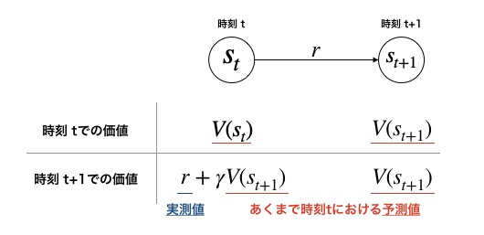

# スクリプト概要　　
* TD法を実装したスクリプト  
* 実装済みのアルゴリズムは下記の通り  
  各アルゴリズムの詳細はそれぞれのフォルダを参照  
    * Sarsa  
    * Q-learning  
* 深層学習系列のアルゴリズムは別途実装

# TD法の概要  
## TD法とは  
* モンテカルロ法の欠点として、価値の更新に1エピソード完了する必要があるので学習に時間がかかる  
* TD法では見積もり（予測）の価値を使うことで1ステップごとに更新を行う  

実測と見積もりの誤差を**TD誤差**（Temporal Difference Error）という。  

もし、時刻tにおける見積もり価値V(s_t)が真の価値V*(s_t)と同じならば、TD誤差は0になる。  
つまり、TD誤差が小さくなるように価値を修正していくのがTD法。  

※実測を進めてV(s_t)を見積もり値ではなく実測値
を使うようにすると、モンテカルロ法と同義になる。