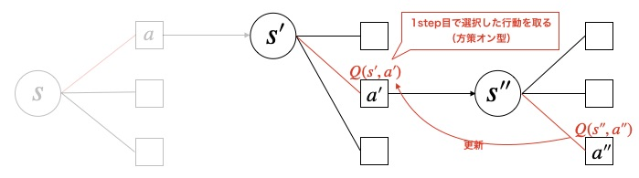

# スクリプト概要
* SarsaでFrozenLakeを強化学習するスクリプト  

# 実行方法
## 学習
* 下記コマンドを実行  
`> python main.py`　　

* 学習が完了すると、学習したエージェントで1エピソード実行される  
* 実行するとlogフォルダ以下にタイムスタンプ名のフォルダが作成され、ログと学習結果が保存される  

---
# Sarsaの概要  
## 前提
* Sarsa（やQ-learning、DQN）は状態価値ではなく、**行動価値Q(s,a)** を用いる。  
  行動価値Q(s,a)とは、状態sのときに行動aを取ったときに未来に得られる報酬の期待値。  

## Sarsaとは  
* TD法のアルゴリズムの一種  
* 1ステップごとにTD誤差を計算して行動価値を更新していく  
* 更新の際の行動選択と実際の行動選択で同じ行動を取る**方策オン型**の手法  

更新式は下記の通り。  

## Sarsaの処理イメージ  
<u>1step目</u>  
次の行動a'はε-greedy法などで選択する。  

<u>2step目</u>  
行動a'は1step目で選択した行動にする（ **方策オン型** ）  

